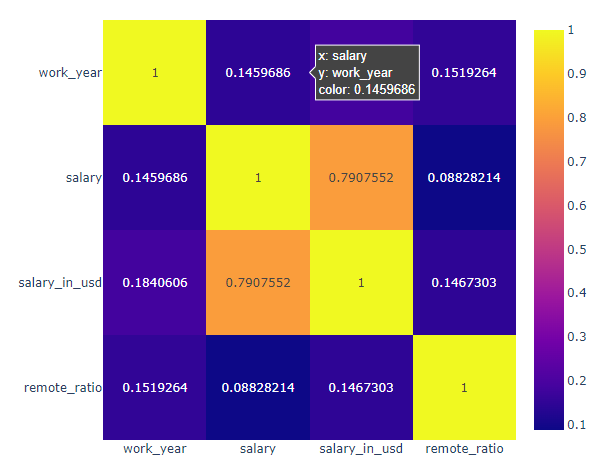
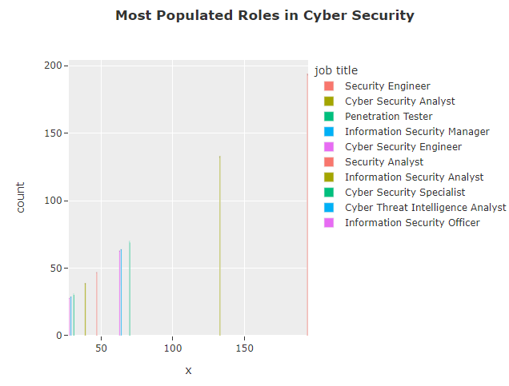
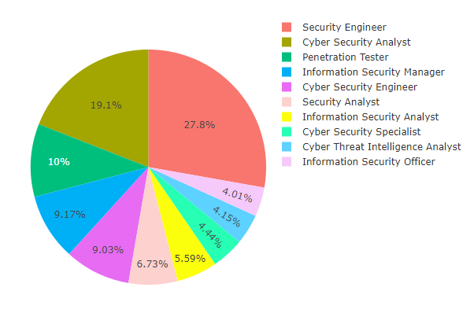
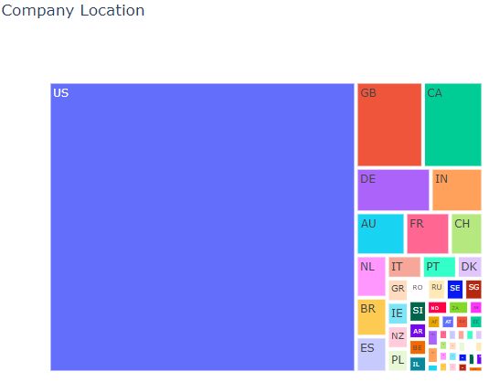
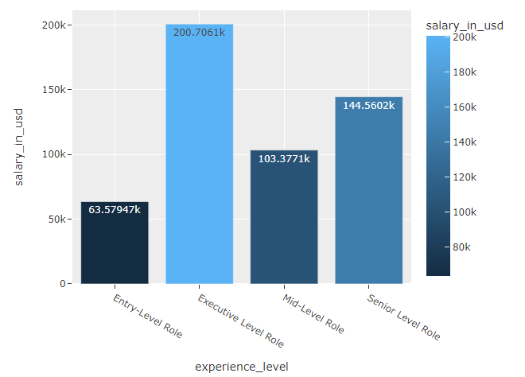
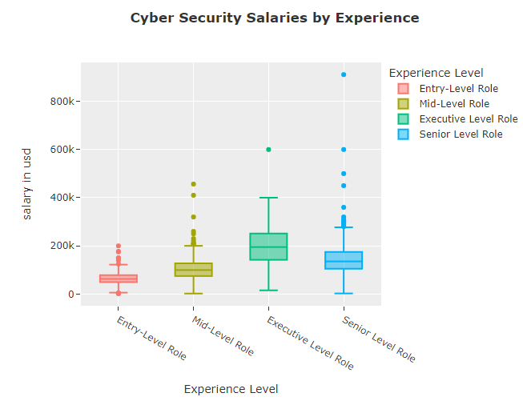

<h1 align="center">

</h1> 

# Cybersecurity Salary Analysis

  

Analysis of Cybersecurity job roles and salaries, utilizing a comprehensive dataset to evaluate market trends and salary distributions across different geographic locations and experience levels. As a Data Science Master's student preparing to enter the job market in 2023, this analysis is particularly aimed at identifying lucrative roles and key locations for Cybersecurity professionals.
  

<h1 align="center">

</h1> 

## 🔑 Key Feature

### Data Cleaning and Preparation:

Initial data handling involves checking for null values and deciding whether to impute or remove them to maintain dataset integrity.
  

### Exploratory Data Analysis (EDA):

Conducts a thorough examination of the Cybersecurity roles and their corresponding salaries, highlighting which roles are the most compensated.
  

### Geographic Salary Distribution:

Analyzes the distribution of jobs and their salaries across different locations, with a focus on identifying the regions with the highest number of opportunities.
  

### Experience Level Comparison:

Compares average salaries across different experience levels from entry-level to executive roles, providing insights into career progression and potential earnings.
  

### Visual Insights:

Utilizes advanced visualization tools like Plotly to represent data through interactive charts and graphs, enhancing the understanding of trends and outliers.
  

## 🧠 Skills
- Python
- Data Analysis
- Plotly and Seaborn for Visualization
- Pandas for Data Manipulation
- Statistical Analysis
- Pandas

# Please Click the link below to view dynamic data visualization
https://nbviewer.org/github/Dre1896/Cybersecurity-Salary-Analysis/blob/main/Cyber_Salary_Analysis.ipynb
